大家好，我是陆徐洲。

上篇分享完 gstack 之后，留言区有读者提到了两个名字：Superpowers 和 BMAD。

[Claude Code + gstack，顶级的产品、架构设计框架](https://mp.weixin.qq.com/s?__biz=MzU0MDcyMDQ0Nw==&mid=2247484336&idx=1&sn=e8628a3b8ac27c98b1d40ad5bb26ce36&scene=21#wechat_redirect)

都是 Claude Code 的框架级增强方案。Superpowers 11 万 star，BMAD 4.2 万，加上 gstack 的 4.4 万，基本代表了当前社区的三种路线。

有人问能不能横向比一下。

今天就来公平对比一下。同一个需求，同一段输入，分别跑一遍设计阶段，看产出。

需求就用上篇那个：检验科 AI 科研智能体，NL2SQL 查数据、统计分析、文献检索、论文辅助，Web + Java + Python，先做本地可演示的 MVP。

先说 Superpowers。

创始人 Jesse Vincent，Perl 和 Keyboardio 的作者。核心理念是流程强制：7 阶段流水线加 TDD，不可跳过。安装方式最简单，Claude Code 插件市场 /plugin install 一行搞定。

我把需求丢进去，它开始追问。

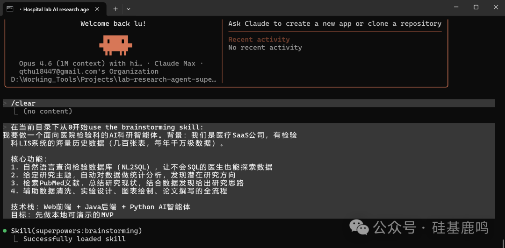

追问方式很直接：给你 ABCD 四个选项，你选一个，它接着问下一个。

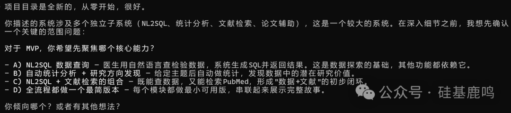

MVP 聚焦哪个核心能力？数据用真实的还是 mock 的？前端交互是对话式还是模块式？AI 框架选 LangChain 还是自研？

大概八九轮选择题做完，它对需求有了完整理解。然后分段出设计文档：系统架构、数据库设计、Agent 服务、Java 后端、React 前端，每段让你确认后进入下一段。

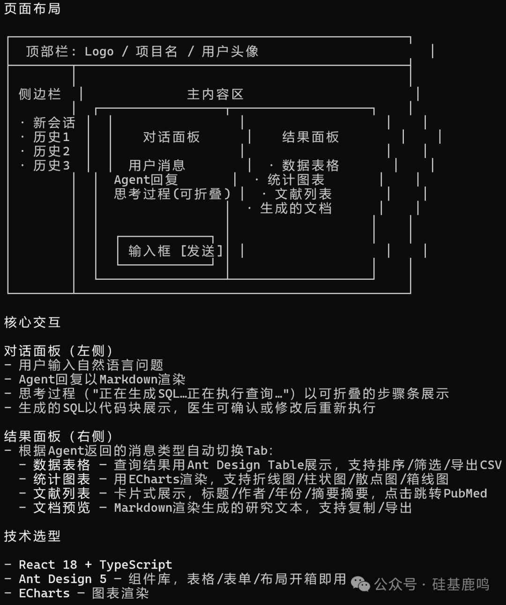

最后自动跑了一轮 spec review，找到 11 个问题，最关键的是 SSE 回调协议存在死锁风险，自动修复后提交。

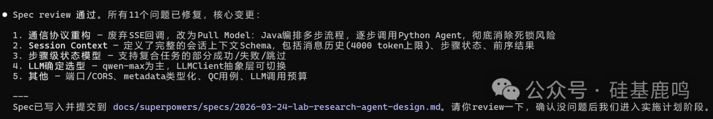

整个过程大约 **1.5 小时**，产出 **1 份 331 行的设计文档**。

速度不慢。有个明显的问题：全程都是选择题式的追问，没有任何发散性引导。它不会问"你有没有想过这个产品的竞争壁垒是什么"，不会挑战"你确定医生最需要的是查数据而不是找方向"。

你说什么，它就照着做。不挑战你，也不帮你多想一步。

需求已经想清楚了？拿它快速出工程文档，没问题。还在摸索阶段？那它能做的比较有限。

说实话跑完 Superpowers 有点不过瘾。接着试 BMAD。

BMAD 是 Brian Madison 做的，42K star，走的是完全不同的路线：文档驱动，12 个以上 Agent 角色分工，每一步产出的文档是下一步的输入。npx bmad-method install 装完，项目里多了一个 _bmad 目录和几十个 skill 文件。

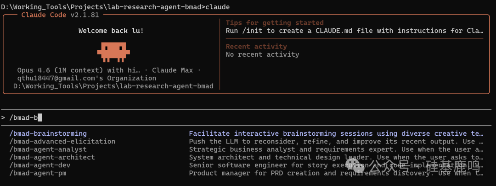

我输入 /bmad-brainstorming，同样的需求。

然后我在这个工具上花了 5 个小时。

第一阶段是角色扮演式脑暴。它没问技术选型，上来就说：想象你是一个 30 岁出头的检验科主治医生，有科研压力但不会写 SQL，你第一次打开这个产品最想干什么？

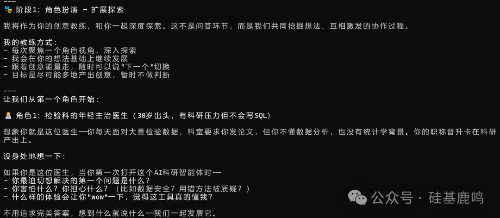

我说：最迫切的是知道自己能研究什么方向。

它抓住这个点往下挖：那医生害怕什么？害怕投入半年发现数据不够。什么体验会让他信任这个工具？分析结果符合临床经验的时候。

然后它主动提出了一个我没想到的产品概念：**课题可行性仪表盘**。在推荐研究方向的同时展示数据量够不够、缺失率多少、时间跨度是否足够。把"半年后发现数据不够"的风险前置到选题 5 分钟内。

接着切换到第二个角色：50 岁的科主任。

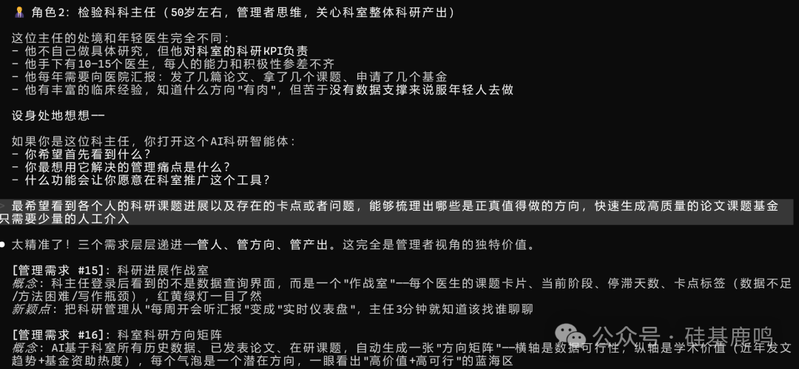

科主任不自己做研究，但对科室科研 KPI 负责。它从管理者视角挖出了"科研进展作战室"、"科室科研方向矩阵"、"双模式引擎"（探索模式用于教学，快速模式用于产出）等需求，这些是纯技术视角根本想不到的。

之后是科研管理处视角、产品负责人视角、开发团队视角。5 个角色走完，产出了 **39 个产品概念**。

坦白说，这里面有不少东西我们团队内部讨论的时候没有明确提出来。比如"文献锚定式发现推荐"，数据发现了异常就自动去 PubMed 找类似的已发表论文，给医生一个"这个方向有人走通了"的安全感。再比如从商业角度提出的"科研产出驱动的续费飞轮"，北极星指标不是 DAU，而是"辅助发表论文数"。

第二阶段是形态分析，把 39 个概念按六个维度做交叉矩阵，排出 MVP 到 V3.0 的演进路线。

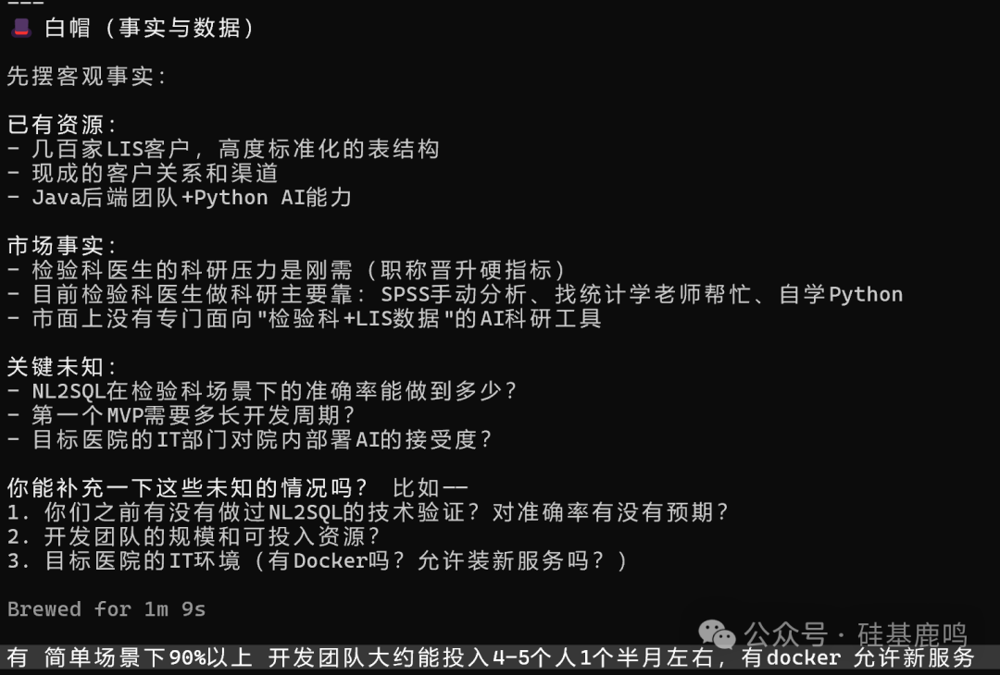

第三阶段是六顶思考帽验证，从事实、风险、收益等六个维度验证 MVP 方案。它问了几个很实际的问题：NL2SQL 准确率验证过吗？团队能投入几个人？目标医院有 Docker 吗？

gstack 也问过类似的，但 BMAD 追得更深，而且它会把你的回答织进后面每一份文档里。

脑暴做完，进入文档生产环节。

PRD 自动验证评分 **8.6/10**，33 条功能需求覆盖率 100%。

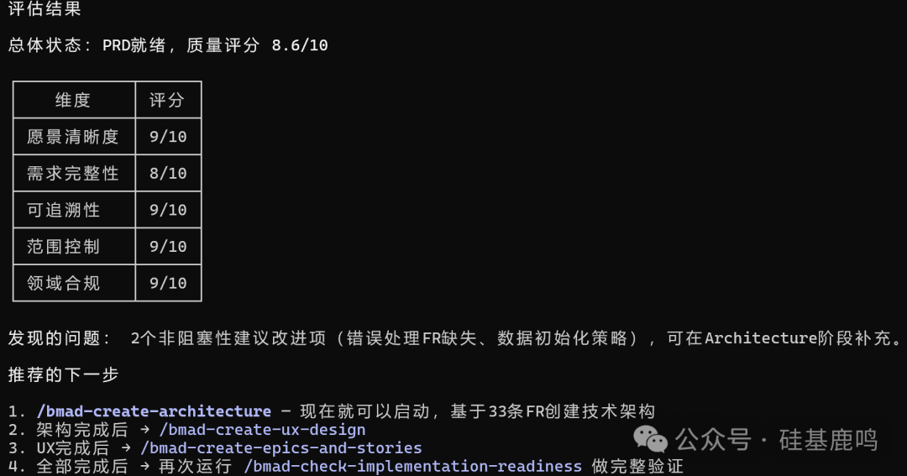

架构设计生成了完整的技术决策清单，从数据架构、ETL 流程到部署方案，决策优先级和延迟决策分得很清楚。

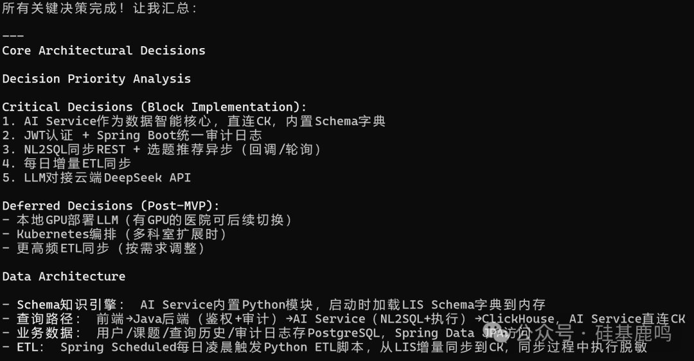

Epic 依赖关系图把 7 个 Epic 的实施顺序和阻塞关系画得明明白白。

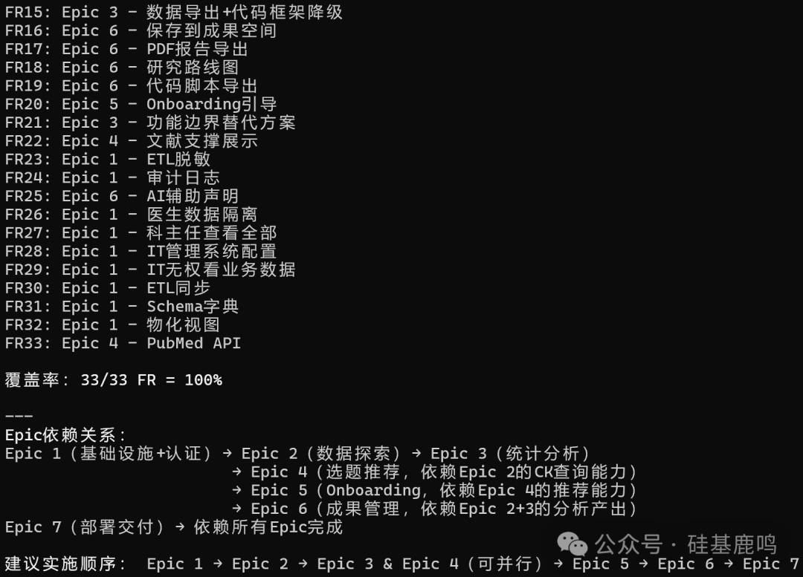

UX-design 是最重的一步，一个指令内部有 **14 个子步骤**，从信息架构到交互模式到响应式布局，每步都有明确产出物。

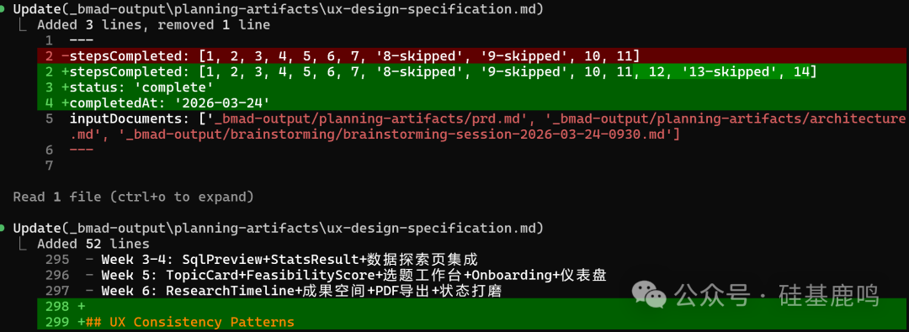

5 个大步骤全部跑完，生成 **5 份规范化 md 文档**，每份大约 500 行。

代价也实实在在：**5 小时，吃掉了 Max 20x 订阅（$200/月）5 小时滚动限额的 20%**。换算一下，普通 Pro 订阅跑同样的流程，大概率会在中途撞限额。

环节多、文档厚、token 烧得快。社区有人说用 BMAD 每天撞限额，体验下来是这么个情况。

话说回来，如果你做的是一个准备长期投入的商业产品，这 5 小时跑下来的东西，我觉得比我们团队当初开了一两周会的产出要全面。

三个框架跑完同一个需求，简单总结一下。

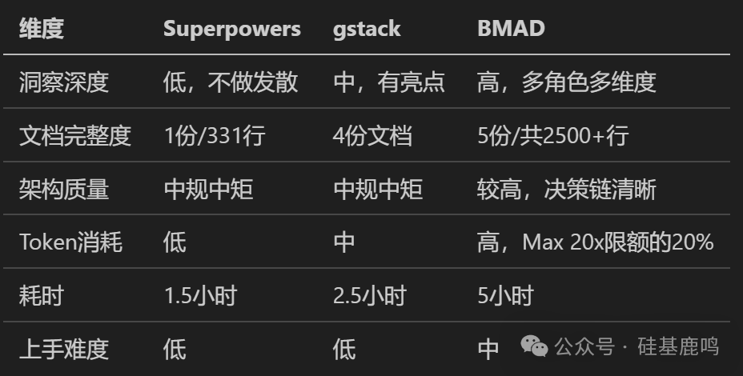

如果给设计阶段的产出打个分：BMAD 大概 95，gstack 80，我们团队做出来的初版大概 70，Superpowers 略低于团队初始水平。

架构方案这块三个工具给的差不太多，差距主要在需求挖掘上。BMAD 从 5 个角色挖出 39 个概念，gstack 在"主动推送研究方向"上有独到洞察，Superpowers 基本是你说什么它做什么。

社区现在有个组合用法我觉得挺合理的：**gstack 做产品设计和 QA，Superpowers 做 TDD 编码实现**。BMAD 适合在项目最前期用一次，把需求和产品设计做扎实。

不用全押一个，按项目阶段选就行。

我是陆徐洲，一家 LIMS 公司的 AI 算法负责人。关注我，让我们一起在 AI 落地实践的路上，走得更远。

感谢您阅读我的文章。有任何关于AI提效或者工程落地实践方面的问题都可以加我微信，交个朋友，一起探讨，共同进步。

