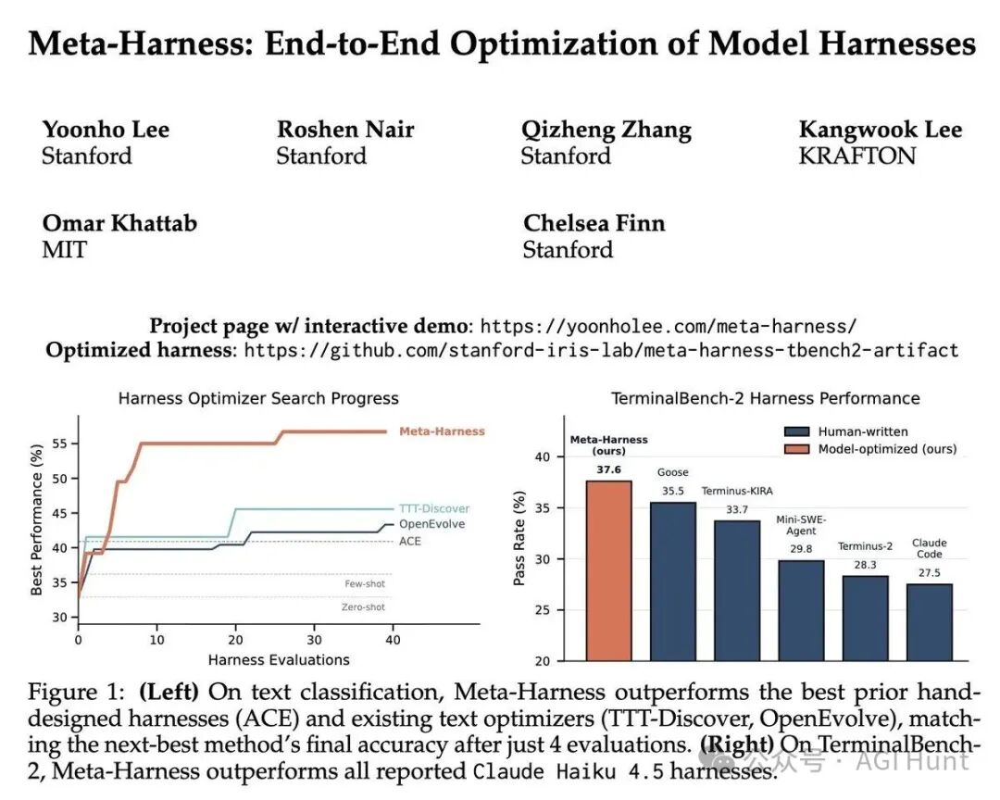
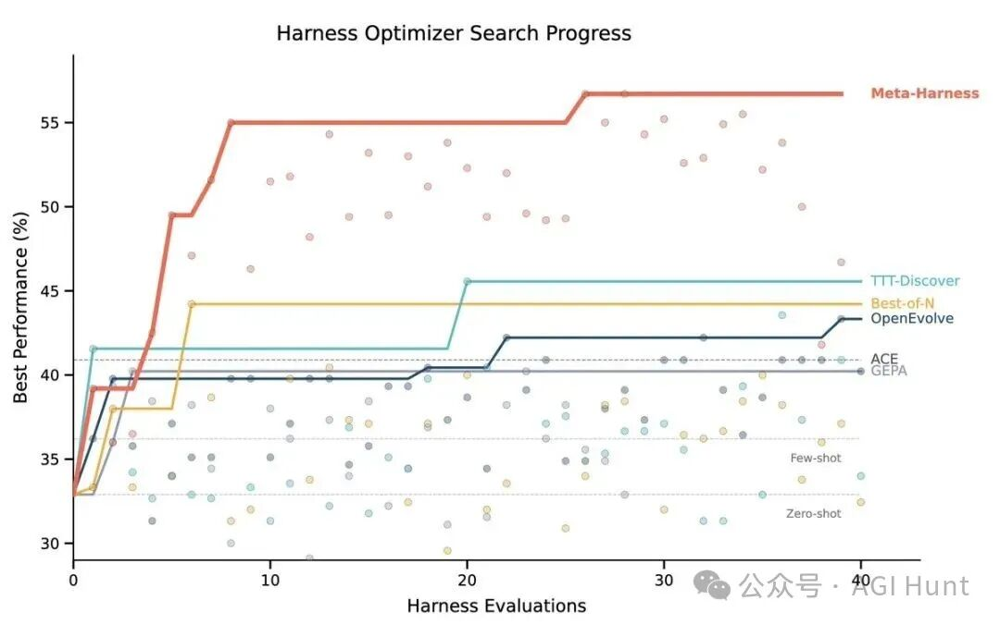
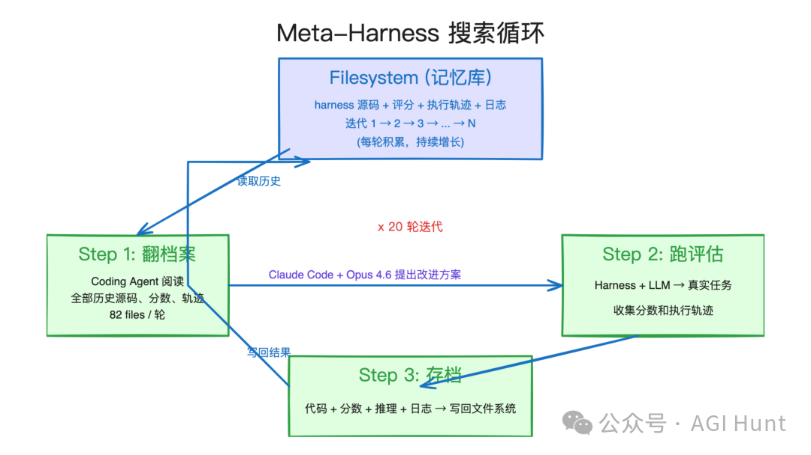
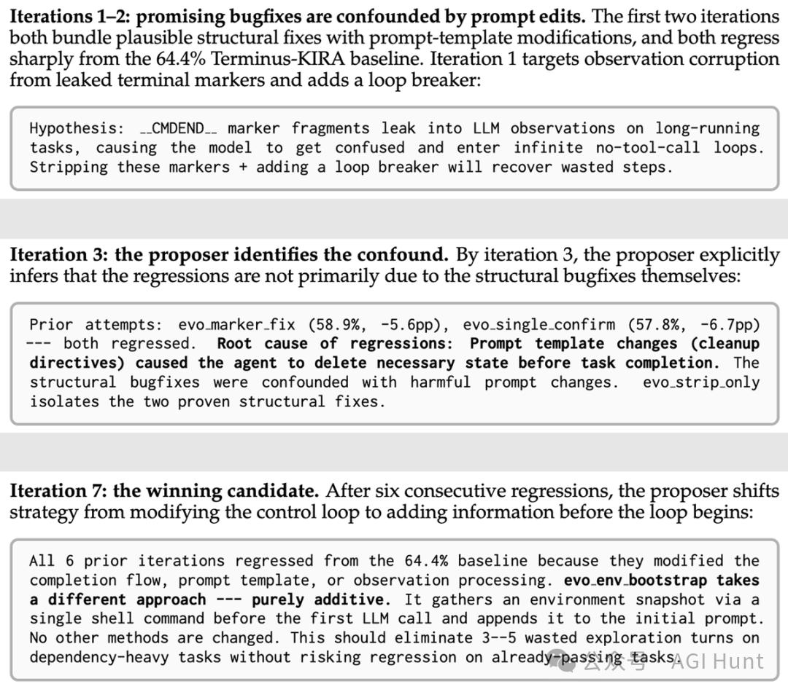
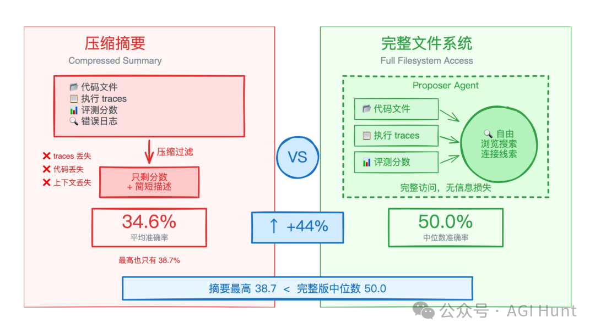
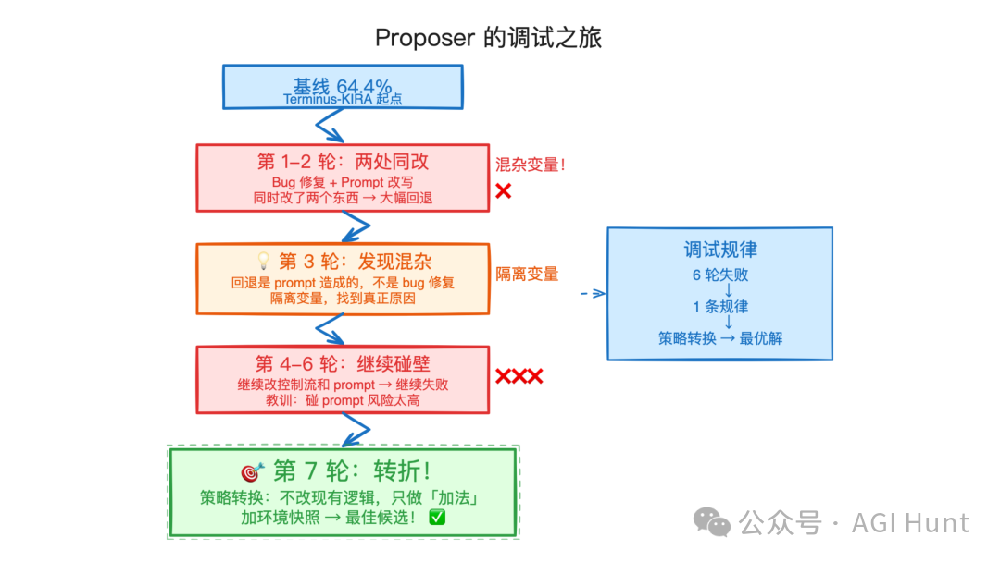
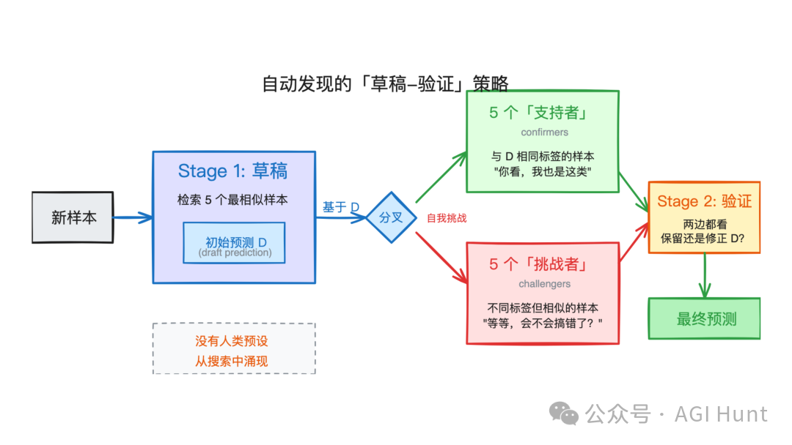
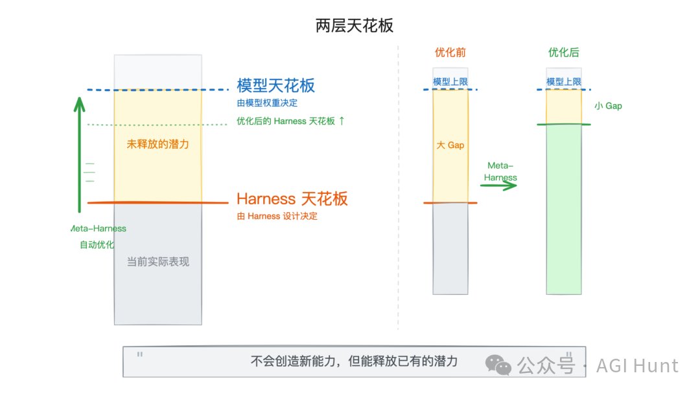
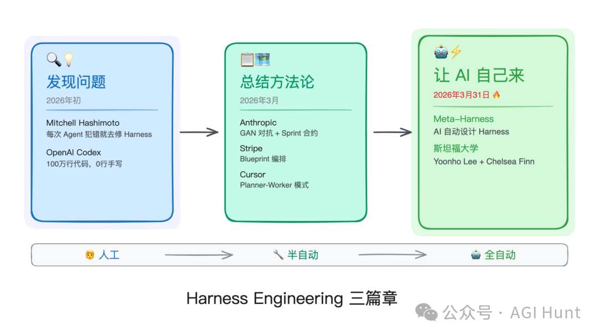

斯坦福今天放出一篇论文，核心思路在于：让 AI 自动设计 Harness，替代人类工程师的手工调参。

在上一篇 Harness Engineering 的文章《[模型不是关键，Harness 才是](https://mp.weixin.qq.com/s?__biz=MzA4NzgzMjA4MQ==&mid=2453481768&idx=1&sn=72a99eef97bc7f0dcb3eddb99573a0ab&scene=21#wechat_redirect)》中，我们提到：同一个模型，换一套 Harness，性能能翻倍。OpenAI、Anthropic、Stripe 各有各的编排哲学，但共识是：Harness 才是决定 Agent 表现的关键变量。

那……既然 Harness 这么重要，为什么还得靠人类工程师一轮一轮地手动迭代呢？

斯坦福的 Yoonho Lee（切尔西·芬恩的博士生）和 Omar Khattab（DSPy 的作者）给出了一个回答：**把 Harness 优化本身也变成一个 Harness。**

****

论文叫 Meta-Harness，名字起得差点让我以为是 Meta 的新模型……

01
## 先说结果

在文本分类任务上，Meta-Harness 比当前最好的人工设计方案 ACE 高了 7.7 个百分点，同时 context 用量只有 ACE 的四分之一。

在 IMO 级别的数学推理上，一个被自动发现的检索策略，在五个从未见过的模型上平均提升了 4.7 个百分点。

而在 TerminalBench-2 这个 Agent 编程基准上，Meta-Harness 自动发现的 Harness 拿到了 76.4% 的通过率，超过了人工精心调教的 Terminus-KIRA（74.7%），在所有 Opus 4.6 Agent 中排名第二。用 Haiku 4.5 跑的话，更是直接排名第一，超过所有已公开的 Haiku 方案。

Meta-Harness 在文本分类和 TerminalBench-2 上的表现这组数据放在当前 Harness Engineering 那篇文章的语境下看，其实在回答一个更根本的问题：**Harness 设计能不能被自动化？**

答案似乎是，可以，而且效果还挺好。

02
## 怎么做的

Meta-Harness 的核心机制，其实还，挺简洁的。

想象一个程序员在调试代码。

他不会只看最终报错信息就动手改，而是会翻看之前的几次提交记录，对比哪些改动引入了 bug，哪些改动其实是有效的但被别的变更搞砸了。然后基于这些判断，提出下一轮修改。

Meta-Harness 做的就是这件事，只不过调试的对象从代码变成了 Harness 本身。

整个流程分三步循环：

Meta-Harness 搜索循环：翻档案→跑评估→存档**第一步，翻档案。** 一个 Coding Agent（论文用的是 Claude Code + Opus 4.6）去读文件系统里存储的所有历史记录，包括之前每一版 Harness 的源代码、评估分数、执行 trace。

**第二步，跑评估。** 把新提出的 Harness 拿去跑实际任务，收集成绩和 trace。

**第三步，存档。** 把这一轮的所有产物，代码、分数、推理过程、执行日志，全部写回文件系统，供下一轮查阅。

就这样，不断循环。

论文里的典型配置是跑 20 轮迭代，每轮评估约 60 个候选 Harness。

Meta-Harness 搜索循环流程和已有的文本优化方法（OPRO、TextGrad、AlphaEvolve、GEPA 等）相比，Meta-Harness 最关键的设计选择在于：**给 proposer 完整的文件系统访问权限，取代压缩后的摘要。**

这个选择看起来简单，背后的考量却值得展开说说。

03
## 完整历史

现有的文本优化方法，基本都在做某种形式的信息压缩。有的只保留分数，有的只看最近一次的结果，有的让模型先生成一个摘要再做决策。

完整历史 vs 压缩摘要：信息完整度决定优化效果这些压缩在小规模任务上问题不大。但 Harness 优化有个特殊之处：**因果链条特别长。**

一个 Harness 的某个设计决策，比如 prompt 里加了一句清理指令，可能在 30 步之后才导致 Agent 陷入死循环。如果你只看最终分数，或者只看压缩后的摘要，这种长程因果关系就被丢掉了。

论文做了一组消融实验，结果可以说，非常地说明了问题：

信息访问方式

中位数准确率

最高准确率

只看分数

34.6

41.3

分数 + 摘要

34.9

38.7

完整文件系统

**50.0****56.7**只给分数和摘要，中位数准确率 34 左右。给完整的文件系统访问，直接跳到 50。

甚至摘要版的最高准确率（38.7）还不如完整版的中位数（50.0）。换句话说，**压缩信息不只是损失了一些边角细节，而是丢掉了做出正确决策所需的关键线索。**

作者 Yoonho Lee 在讨论中也提到，单次评估就能产生约一千万 token 的原始输出，远超任何模型的 context window。所以不能把所有东西塞进一个 prompt，必须让 Agent 自己决定去读什么。

实际运行中，proposer 每轮迭代平均读取 82 个文件（范围 69-99），其中 41% 是之前的 Harness 源码，40% 是执行 trace，剩下的是分数和其他文件。它的行为模式并非只看上一轮的结果，会跨越多轮历史做对比分析。

这也正是「完整历史」这个设计选择的价值所在：

**让 Agent 自己做信息检索和因果推理，比人类预设的压缩规则更灵活，也更有效。**

04
## 像人一样调试

论文里最精彩的部分，是附录 A 中那段 TerminalBench-2 的搜索轨迹分析。

Proposer 的调试之旅：从失败到转折第 1-2 轮迭代，proposer 同时做了两件事：修复了一个结构性 bug（清理泄漏的标记符号），同时改写了 prompt 模板。两个候选都从 64.4% 的基线大幅回退了。

第 3 轮，proposer 做了一件很像人类工程师会做的事：它回去看了两个失败候选的改动记录，注意到两者有一个共同点，都改了 prompt 模板。于是它显式地推理：

> “ 根本原因：prompt 模板的变更（cleanup 指令）导致 Agent 在任务完成前就删除了必要的状态。结构性 bug 修复和有害的 prompt 变更混在了一起。

这是个典型的混杂变量（confound）识别。它把结构性修复和 prompt 变更拆开，单独测试了结构修复，验证了回退确实是 prompt 造成的。

接下来第 4-6 轮继续在控制流和 prompt 上做修改……继续失败。

到了这个阶段，proposer 倒是学到了一条经验规律：**碰 prompt 和完成逻辑的改动风险太高。**

**第 7 轮，转折来了。**

proposer 换了一个完全不同的策略：不再修改任何现有逻辑，改为纯粹的「加法」操作，在第一次 LLM 调用之前加一个环境快照命令，把当前系统环境信息追加到初始 prompt 里。不动别的，只加信息。

这个候选成了整个搜索过程中表现最好的。

第 8 轮，它把第 7 轮的「环境快照」和之前验证过的「标记符号清理」组合到一起，理由是这两个修复针对的是不同的失败模式，组合起来不会互相干扰。

第 10 轮出现了跨实验迁移：proposer 引用了一个来自另一轮搜索的结果，注意到「不要清理服务产物」这个策略在之前的实验中值 18 个百分点的提升。

**整个过程就是一个工程师的调试思路：尝试、失败、识别混杂因素、隔离变量、切换策略、组合已验证的修复、甚至跨实验迁移经验。**

只不过这个「工程师」是一个 Coding Agent。

05
## 搜索速度

和其他文本优化器相比，Meta-Harness 的搜索效率也值得关注。

在文本分类任务上，OpenEvolve 和 TTT-Discover 需要 40 次完整评估才能达到最终性能。Meta-Harness 在前 4 次评估内就追平了它们的最终成绩，然后继续上升，最终高出 10 个百分点以上。

为什么会快这么多呢？

论文把这归因于最小化的外部结构。OpenEvolve 和 TTT-Discover 都有预设的搜索框架，比如固定的变异算子、树搜索结构。这些结构在小规模问题上是有效的约束，但在 Harness 这种搜索空间巨大的问题上，反而成了限制。

Meta-Harness 的外层循环几乎没有预设结构：不指定 parent 选择规则，不限制 proposer 的检索范围，不约束修改的粒度。所有这些决策都交给 proposer 自己判断。

这种「去结构化」的设计在 2026 年初才变得可行，因为它依赖 Coding Agent 足够强大，能自主完成「读文件→推理→写代码→提交」这整个流程。论文在脚注里也坦率地说了这一点。

06
## Harness 长什么样

论文还展示了 Meta-Harness 自动发现的几个 Harness 的具体结构，每个都是 100-1000 行的 Python 程序。

自动发现的草稿-验证策略流程文本分类任务中，它发现了一个「草稿-验证」（Draft Verification）的两阶段策略。先检索 5 个最相似的样本做初始预测，然后基于这个初始预测，再检索 5 个「支持者」和 5 个「挑战者」（标签不同但很相似的样本），让模型决定是否修改判断。

这个设计的巧妙之处在于：第二轮检索依赖第一轮的预测结果，相当于一种 self-challenging 机制。没有人类预先指定这个策略，它从搜索过程中自然涌现了出来。

数学推理任务中，它发现了一个四路由的检索策略：把问题分类为组合数学、几何、数论和默认四种类型，每种类型用不同的检索和重排序参数。比如组合数学类问题偏好难度重排序来增加多样性，而几何类问题则倾向保留原始的结构匹配结果。

这些策略放在论文里看起来合理得近乎显而易见。但重点在于，它们全都是 Agent 通过反复试错自己「长」出来的，没有任何人类预设。

07
## 两个天花板

当然，这篇论文也有它的边界。

两层天花板：模型上限与 Harness 上限Gregor 问到：

> “ 如果 LLM 本身还推理不了这个问题呢？优化 Harness 不就只是在用更快的方式去量一个不会变的天花板吗？

Yoonho Lee 坦率回应：

> “ Harness 优化确实有一个由模型权重设定的天花板。LLM 系统有两个组件：模型和 Harness。这篇论文只自动优化了第二个组件。它不会创造权重中不存在的能力，但能把我们之前没用上的能力释放出来。

这个回应，其实精确地呼应了我在 Harness Engineering 那篇文章里画的那张图：**Big Model 和 Big Harness，两层天花板，缺一不可。**

模型能力决定了理论上限，Harness 决定了实际达到的高度。

Meta-Harness 做的事情，是把 Harness 这一层的天花板尽量往模型天花板靠近。

另一个边界是泛化性的问题。有人担心 Meta-Harness 会不会过拟合到搜索集。论文在这一点上做了比较充分的验证：在文本分类上测试了 9 个从未见过的数据集，平均准确率 73.1%，超过所有基线。在数学推理上，同一个 Harness 在 5 个没见过的模型上都有效。

Yoonho Lee 还提到了一个值得注意的观点：**在文本空间里过拟合，比在权重空间里过拟合要难得多。** 因为在 prompt 里「记住」特定任务的答案远不如在权重里做这件事高效。而且 Harness 的代码是可读的，人类可以直接检查有没有硬编码的投机取巧。

这和权重空间的黑箱优化……倒是形成了一个挺鲜明的对比。

08
## 第三篇章

如果把这篇论文放到整个 Harness Engineering 讨论的时间线上看，它打开的其实是一个新的篇章。

Harness Engineering 三篇章：从人工到全自动第一篇章是「发现问题」。

Mitchell Hashimoto 说，每次 Agent 犯错就去工程化一个解决方案。OpenAI 的 Codex 团队用 5 个月和 100 万行代码证明了 Harness 比 Agent 本身更难搞。

第二篇章是「总结方法论」。

Anthropic 的工程博客详细展示了 GAN 式对抗、sprint 合约、Playwright 评估。Stripe 的 Minions 提出了 Blueprint 编排。这些都是人类工程师总结出的 Harness 设计模式。

而 Meta-Harness 开启的第三篇章……是「让 AI 自己来」。

当然了，这并不意味着人类工程师会被替代。

论文的 proposer 需要一个人类定义的「搜索技能」作为引导，包括初始 Harness 种群、评估指标、文件系统的组织方式。人类仍然在定义问题的边界和目标。

但在这个边界之内，具体的 Harness 设计决策，该用什么样的 prompt 结构、什么样的检索策略、什么样的状态管理逻辑，这些可以交给 Agent 去搜索。

回到 Anthropic 那篇博客《[Anthropic 的 Harness 设计：build to delete](https://mp.weixin.qq.com/s?__biz=MzA4NzgzMjA4MQ==&mid=2453481858&idx=1&sn=b9d9771dff6bdf3020ce0d08d1f77d8f&scene=21#wechat_redirect)》的核心观点：**Harness 要 Build to Delete，造出来是为了有一天能拆掉。**

Meta-Harness 提供了一个更激进的可能性：也许不需要等模型变强再手动拆，**直接让 AI 替你重新设计一套更好的。**

Noam Brown 说「别花六个月搭一个六个月后就被淘汰的东西」。

Meta-Harness 说，**那就别自己搭了。**

◇ ◆ ◇

相关链接：

•  论文：https://yoonholee.com/meta-harness/paper.pdf

•  项目主页：https://yoonholee.com/meta-harness/

•  推文：https://x.com/yoonholeee/status/2038640635482456118

